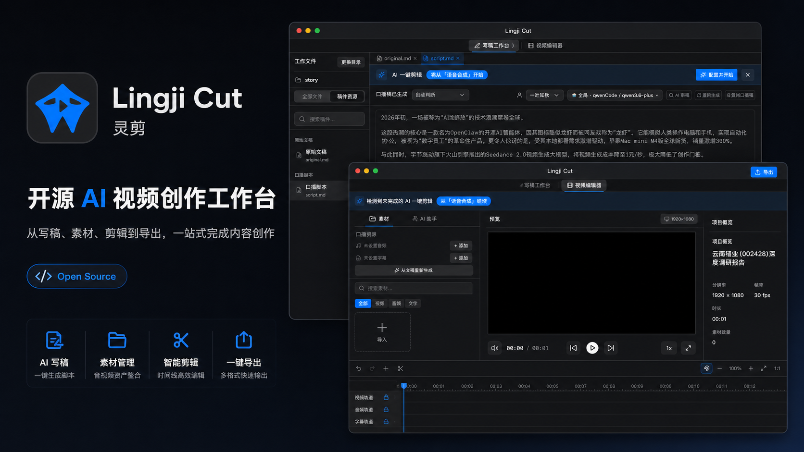

# Lingji Cut / 灵剪



🌐 **[访问官网](https://yoqu.github.io/lingji-cut-homepage/)** — 在线了解灵剪的功能特性、使用演示和快速上手指南。

**Lingji Cut（灵剪）** 是一个本地优先的开源 **AI 视频创作工作台**。它把内容创作中分散的环节串成一条完整流水线：从选题采集、写稿、AI 审稿，到语音合成、字幕处理、内容分析、信息卡 / 封面生成、时间线剪辑，再到 Remotion 导出和多平台发布——全部在同一个桌面端、以本地优先的方式完成。

它不是单一的视频播放器或字幕工具，而是面向内容创作者的桌面端创作环境。你可以从一份原始素材开始，逐步生成口播稿、音频、字幕、信息卡和最终视频，也可以直接导入已有音频 / 字幕进入编辑器。

## 交流与联系

欢迎扫码加入灵机剪影微信群，交流使用体验、功能建议和 AI 视频创作工作流；也可以通过作者微信直接联系我。

| 微信群交流 | 联系作者 |
| --- | --- |
|  |  |

### AI 视频创作全流程

```text
选题采集             写稿审稿           AI 视频流水线            时间线        导出        发布
灵机采风 Chrome 扩展 → original.md   →  TTS 语音合成          →  时间线编辑  →  Remotion  →  多平台
监听抖音博主            script.md        字幕解析 / 内容分析        素材 / 卡片     H.264        B站 / 视频号
待创作箱               AI 写稿 / 审稿    封面候选 / Motion Card    动画 / 字幕     MP4          抖音 / 快手 / 小红书
```

每个环节既能由 AI 自动推进，也能在桌面端逐步手动精调；既能从「灵机采风」采集的选题开始，也能直接从已有音频 + 字幕进入编辑器。

## Highlights

- **AI 写稿工作台**：管理 `original.md` / `script.md`，支持多文件标签、稿件资源、搜索替换、版本历史、AI 生成、AI 审稿和批注采纳。
- **自动口播流程**：从文稿一键触发 TTS、字幕解析、内容分析、封面候选和视觉卡片生成；AI 卡片增量流式呈现并自动落轨。
- **专业时间线编辑**：支持音频、字幕、图片、视频、文字、AI 卡片、多视觉轨、多音频轨、拖拽、吸附、拆分、裁剪、复制 / 剪切 / 粘贴和轨道锁定。
- **Motion Card 数据动画**：AI 生成自由 Remotion TSX 卡片（文字 / 数字 / 表格 / 图表），出卡前还会先生成逐拍动画指导；内置风格模板库，预览与导出共用同一份编译产物。
- **多 Provider AI 配置**：支持 OpenAI 兼容、Gemini、LM Studio 等 LLM Provider，多种图片 / 视频生成 Provider，以及多 Provider TTS 音色体系（MiniMax、Xiaomi MiMo 含克隆音色）。
- **内置 Pi Agent**：应用内开箱即用的对话 agent（零安装、复用应用 LLM 配置），可直接改稿 / 改视频，编辑器实时热重载。详见 [Agent 使用指南](docs/agent-guide.md)。
- **外部 Agent / MCP 集成**：`lingji-editor` MCP Server 提供 `lingji_*` 工具给 Claude Code / Codex / Gemini，配合 file-first 契约直接编辑项目文件。
- **灵机采风 Chrome 扩展**：监听抖音博主、采集公开视频、本地转录，并经联动桥推送到「待创作箱」做二创。详见 [灵机采风插件使用指南](docs/chrome-extension-guide.md)。
- **多平台发布**：发布选项卡内置多画幅封面工作台（16:9 / 4:3 / 3:4）、发布元数据（标题 / 简介 / 标签）与 B站分区 AI 智能推荐，支持发布到 B站 / 视频号 / 抖音 / 快手 / 小红书。
- **命令行与自动化**：无头 `lingji` CLI 在终端里驱动音频、字幕分析、卡片、封面、导出等完整流水线。
- **Remotion 导出**：通过 Remotion 渲染引擎（自带 Chrome Headless Shell + ffmpeg）导出 H.264 MP4，支持编辑器预览、时间线 seek 与导出进度展示。
- **本地优先**：项目文件保存在用户选择的本地目录，仓库不需要保存任何真实 API Key。

## Screenshots

更多界面截图在 [`宣传制作/`](宣传制作/) 和 [`pics/`](pics/) 目录中。仓库首页宣传图位于 [`docs/assets/lingji-cut-hero.png`](docs/assets/lingji-cut-hero.png)。

## Tech Stack

- Electron 41 + electron-vite
- React 19 + TypeScript 6
- Remotion 4（视频渲染引擎，自带 Chrome Headless Shell + ffmpeg）
- Zustand
- CodeMirror 6
- Framer Motion
- TailwindCSS 4 + 自研 macOS 专业工具 UI 组件
- MCP SDK + 内置 Pi Agent / 外部 Agent 集成
- 灵机采风 Chrome 扩展（Manifest V3 + CRXJS + Vite，独立工程）
- Vitest

## Quick Start

### 1. Install

```bash
npm install
```

仓库包含项目级 `.npmrc`，默认使用 npmmirror 的 npm / Electron / Node 原生模块镜像，适合国内网络环境。npm 11 可能提示 `Unknown project config "electron_mirror"` 等 warning，这通常不代表安装失败。

如果 Electron 下载被本机 npm 配置忽略，可以手动设置：

```bash
export ELECTRON_MIRROR="https://npmmirror.com/mirrors/electron/"
export npm_config_disturl="https://npmmirror.com/mirrors/node/"
npm install
```

Windows PowerShell：

```powershell
$env:ELECTRON_MIRROR="https://npmmirror.com/mirrors/electron/"
$env:npm_config_disturl="https://npmmirror.com/mirrors/node/"
npm install
```

### 2. Development

```bash
npm run dev
```

### 3. Build

```bash
npm run build
```

### 4. Package

macOS：

```bash
npm run dist:mac
```

Windows：

```bash
npm run dist:win
```

默认产物在 `release/` 下：

- `release/灵机剪影-darwin-arm64/灵机剪影.app`
- `release/灵机剪影-darwin-x64/灵机剪影.app`

当前打包产物是本地 `.app`，尚未接入正式签名、notarization、DMG / PKG 分发。

### 5. Test

```bash
npm test
```

运行单个测试：

```bash
npx vitest run tests/editor.test.tsx
```

## Common Commands

```bash
npm run dev          # Start Electron + Vite dev server
npm run build        # Build main, preload and renderer
npm run package:win  # Package Windows app directory
npm run dist:win     # Build + package Windows app directory
npm run package:mac  # Package macOS .app
npm run dist:mac     # Build + package macOS .app
npm test             # Run Vitest
npm run test:watch   # Run Vitest in watch mode
npm run build:cli    # Bundle the lingji CLI into dist-cli/lingji.mjs
npm run install:cli  # Build the CLI and link `lingji` globally
npm run uninstall:cli # Remove the global `lingji` command
```

## 命令行工具 (lingji CLI)

除桌面端外，仓库还提供一个无头命令行工具 `lingji`，用于在终端里驱动项目流水线（音频、字幕分析、卡片、封面、导出等）。它通过 MCP 服务地址与运行中的灵机剪影桌面端通信，因此使用前需保证桌面端在跑（或用 `--server` 指定服务地址）。

### 全局安装

```bash
npm run install:cli
```

该脚本会先用 esbuild 把 `cli/src/index.ts` 打包为 `dist-cli/lingji.mjs`，再通过 `npm link` 注册到全局，之后任意目录都能直接使用 `lingji`：

```bash
lingji --help
```

> `npm link` 是软链到本仓库的构建产物。以后改了 CLI 源码，只需重新 `npm run build:cli` 即可生效，无需再次 link。
>
> CLI 安装在「当前 Node 版本」的全局 bin 下。若使用 nvm 切换到别的 Node 版本，需要在该版本里重新执行一次 `npm run install:cli`。

卸载全局命令：

```bash
npm run uninstall:cli
```

### 常用子命令

```bash
lingji project current                    # 显示应用当前活动项目
lingji project list                       # 列出最近项目
lingji audio gen [--project <p>] --wait   # 生成口播音频 (TTS)
lingji subtitle analyze --wait            # 字幕分析 + 卡片生成
lingji cards list|show|update|regenerate|regen-media|convert|delete
lingji cover prompt|image|gen --wait      # 封面提示词 / 出图 / 一次性
lingji export [--out <file>] --wait       # 导出 MP4
lingji task status|list|cancel|wait <id>  # 任务查询与控制
```

全局开关：`--json`（JSON 输出）、`--server <url>`（覆盖 MCP 服务地址）。

## Typical Workflow

### 从素材到视频

1. 在欢迎页新建或打开一个本地项目目录。
2. 导入原始文稿，或通过链接导入视频并生成转录文本。
3. 在写稿工作台生成 / 编辑 `script.md`。
4. 使用 AI 审稿批注优化文稿。
5. 触发 AI 视频流水线：TTS、字幕解析、内容分析、封面生成、信息卡排布。
6. 进入视频工作台调整时间线、素材、字幕、卡片和动画。
7. 导出 MP4。

### 从已有音频和字幕开始

1. 新建或打开项目目录。
2. 导入音频和 SRT。
3. 在视频工作台编辑时间线。
4. 可选：运行 AI 分析、生成卡片或封面。
5. 导出 MP4。

## AI Configuration

Lingji Cut 主要通过应用内"设置"页面保存 AI 配置，不依赖仓库内 `.env` 存放密钥。

主要配置区域：

- **AI 基础配置**：管理 OpenAI 兼容、Gemini、LM Studio 等 LLM Provider。
- **图片生成**：管理即梦、OpenAI Image、MiniMax、豆包、Imagen、通义万相和自定义图像 Provider。
- **视频生成**：管理视频 Provider 配置（与 image/video 卡片表单联动）。
- **TTS 语音合成**：配置 MiniMax API Key、音色、语速、音量、音调、情绪和模型。
- **提示词配置**：管理内置 / 全局 / 项目级提示词，并为不同 Prompt Kind 绑定不同 Provider（含 `card.image`、`card.video`）。
- **AI Agent**：内置 Pi agent 的审批策略、模型与技能配置（复用上面的 LLM Provider 凭证）。
- **MCP 服务**：启动 `lingji-editor` 本地 MCP Server，并注册到 Claude Code / Codex / Gemini。
- **发布账号**：管理 B站 / 视频号 / 抖音 / 快手 / 小红书的发布账号登录态。
- **配置备份**：导出、预览、导入全局设置与 Agent 配置备份。

> 关于内置 Pi 与外部 Agent 的完整用法，见 [Agent 使用指南](docs/agent-guide.md)；关于灵机采风扩展，见 [灵机采风插件使用指南](docs/chrome-extension-guide.md)。

> 请不要把真实 API Key、Session ID、Cookie 或访问令牌提交到源码、测试、文档或截图中。

## Project Files

应用运行时会把创作数据保存在用户选择的项目目录中。常见项目文件包括：

- `project.json`：统一工程文件，包含 `timeline`、`aiAnalysis`、`script` 等段落。
- `original.md`：原始素材 / 转录文本。
- `script.md`：口播成稿。
- `podcast-audio.mp3`：TTS 生成的口播音频。
- `podcast-subtitles.srt`：口播字幕。
- `podcast-subtitles.original.srt`：TTS 初始字幕备份。
- `covers/`：封面候选图。
- `ai-cards/`：AI 视觉卡片资源。
- `imports/`：外部视频 / 音频导入产物。
- `configs/prompts/`：项目级提示词覆盖。

历史版本中的 `timeline.json`、`ai-analysis.json`、`script-state.json` 会在加载旧工程时迁移到 `project.json`。

## Repository Structure

```text
electron/
  agent-runtime/        多协议 Agent runtime（Pi / Claude / Codex）、内置 Pi 进程内 SDK
  acp/                  Claude ACP、file-first 契约同步、权限策略
  conversations/         Agent 会话数据库与 IPC
  mcp/                   lingji-editor MCP Server、工具注册、客户端注册配置
  pipeline/              Pipeline 任务编排、TaskRegistry、HeadlessProjectContext
  remotion/              卡片编译（esbuild）、bundle、renderMedia 导出
  ai-edit/               file-first 编辑锁与校验回传
  script-history/        脚本文稿版本历史
  video-import/          视频导入、抽音频、ASR、转录落盘
  main.ts                Electron 主进程、IPC、Remotion 渲染、TTS、发布
  preload.ts             Renderer 安全桥接
  project-file.ts        project.json 读写与旧工程迁移

src/
  components/            编辑器、时间线、Inspector、AI 面板、Agent UI
  components/script/     脚本工作台文件树、批注、导入预览、版本 UI
  components/publish/    发布选项卡：多画幅封面工作台、发布元数据、B站分区
  components/settings/   AI、TTS、Agent、MCP、提示词、发布账号、备份配置页
  hooks/                 AI 视频流水线、连接状态、缩略图等 hooks
  lib/                   AI、提示词、Motion、字幕、导出、发布、持久化、IPC 客户端
  pages/                 Setup、Editor、ScriptWorkbench、Settings
  remotion/              Remotion composition、timeline-to-sequences、overlays、card-host
  store/                 timeline、ai、script、agent、task-progress、publish
  ui/                    macOS 风格基础组件、patterns、tokens、motion
  types.ts               时间线核心类型
  types/ai.ts            AI 卡片、Provider、提示词绑定类型

extensions/sonar/        灵机采风 Chrome 扩展（独立工程，抖音监听采集 + 联动桥）
cli/                     无头 lingji CLI 源码
tests/                   Vitest 单元与组件测试
docs/assets/             README 与宣传素材
docs/ai-contract/        file-first 编辑契约（视频 / 文稿 / 锁 / 结果协议）
docs/superpowers/        设计规格与实施计划沉淀
```

## Architecture Notes

- Renderer 不直接使用 Node API。主进程能力通过 `electron/preload.ts` 暴露，并在 `src/lib/electron-api.ts` 声明类型。
- 新增或修改 IPC 时，通常需要同步 `electron/main.ts`、`electron/preload.ts`、`src/lib/electron-api.ts` 和对应测试。
- 工程主存储是 `project.json`。新增工程段落前需要评估迁移、并发写锁和旧数据兼容。
- 渲染引擎为 Remotion：`TimelineData` 经 `buildRenderPlan` 编译为 Remotion 组件树，预览用 `@remotion/player`，导出用 `@remotion/bundler` + `@remotion/renderer`。
- 导出前会把绝对路径素材映射到临时项目目录，避免 Electron 打包后无法访问本地文件。
- AI Motion Card 是 LLM 生成的自由 Remotion TSX（`ai-cards/<id>/motionCard.tsx`），主进程用 esbuild 编译为 CJS 注入，预览与导出共用同一份编译产物。
- 所有耗时操作应接入 `src/store/task-progress.ts` 和底部 `AppStatusBar` 统一进度系统。
- UI 新实现应遵循 `DESIGN.md` 的 macOS 专业创作工具规范。
- Agent / MCP 操作脚本文稿时，应优先通过 `lingji_*` MCP 工具进入编辑器状态。

## 开发建议

- 修改时间线结构前，先看 `src/types.ts`、`src/store/timeline.ts`、`src/lib/timeline-tracks.ts`、`src/lib/timeline-placement.ts`。
- 修改 AI 卡片结构前，先看 `src/types/ai.ts`、`src/types/motion.ts`、`src/lib/ai-persistence.ts`、`src/store/ai.ts`、`src/remotion/`。
- 修改脚本工作台前，先看 `src/pages/ScriptWorkbench.tsx`、`src/store/script.ts`、`src/lib/script-persistence.ts`。
- 修改提示词前，先看 `src/lib/prompts/`、`electron/prompts-io.ts`、`electron/prompt-bindings-io.ts`。
- 修改 Agent / MCP 前，先看 `electron/agent-runtime/`、`electron/acp/`、`electron/mcp/`、`src/components/agent/`。
- 修改 Pipeline 前，先看 `electron/pipeline/` 与 `electron/mcp/tools.ts` 中的 `pipeline.*` 注册。
- 修改发布链路前，先看 `src/components/publish/`、`src/store/publish.ts`、`src/lib/publish/`。
- 修改导出链路前，先看 `electron/main.ts`、`electron/remotion/`、`src/remotion/`。

## Security

- `.env`、`.tmp/`、`work/`、`.agents/`、`.claude/`、构建产物和本地运行产物已加入 `.gitignore`。
- 仓库不应包含真实 API Key、Session ID、Cookie、私钥、配置备份或用户项目数据。
- 如果你曾经在旧仓库或本地历史中提交过真实密钥，请立即在对应服务侧轮换密钥。

## 已知边界

- 桌面优先，最小窗口约束约为 `1100 × 760`，暂不以移动端为主要目标。
- Setup 的传统导入仍以音频 + SRT 为主；脚本到视频流程依赖 MiniMax TTS。
- 抖音导入当前使用 `bcut` 转录链路，外部服务可用性会影响结果。
- AI 分析、图片 / 视频生成、TTS、Agent Runtime 都依赖用户配置的外部服务。
- macOS 打包尚未覆盖正式签名和分发链路。

## Contributing

欢迎提交 issue、建议和 PR。建议在较大改动前先说明你想修改的模块和目标，尤其是时间线、工程存储、IPC、Remotion 导出和 AI Provider 相关改动。

## 友情链接

- [LINUX DO](https://linux.do) — 新一代开源社区

## 联系作者

- X / Twitter：[@LYoqu60097](https://x.com/LYoqu60097)
- 微信：`yoqu2020`
- 微信群：扫码加入灵机剪影交流

| 微信群交流 | 联系作者 |
| --- | --- |
|  |  |

## 赞赏支持

灵机剪影是免费开源项目。如果它帮你节省了时间，欢迎扫码请作者喝杯咖啡 ☕，这是项目持续维护的最大动力。

| 微信支付 | 支付宝 |
| --- | --- |
|  |  |

## License

Apache License 2.0. See [LICENSE](LICENSE).
