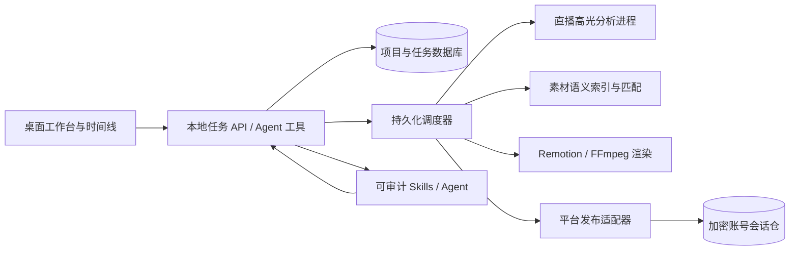

# 产品架构与接口契约（阶段一已确认）

## 1. 产品边界和基座

产品是 Windows 优先、本地优先的桌面工作台。编辑器与预览采用 Lingji Cut 的 Electron + React + Remotion 路线，保留人可逐帧复核和修改的时间线；批处理与发布由持久化任务引擎执行，不能依靠 UI 页面停留来维持任务。Easel 提供可选择的运营 Skills 模板，HotClip 和语义检索作为进程边界内的专用工具，均不直接掌握发布账号凭证。各功能可用开源源码、CLI、AI Skill 或 MCP 组合，但均须通过同一项目模型和任务 API；具体接入见[组件组合图](integration-map.md)。

受保护的不变量：素材与账号凭证绝不交给不需要它们的进程；每个发布任务固定一个账号和一个视频版本，商品请求在阶段一只能为空；同一账号同时最多一个发布动作；未知提交状态先核实再重试。导出的视频、时间线方案、源素材及授权信息都有稳定 ID 和可追踪来源。

## 2. 六项能力的实现设计

### A. 多账号登录、管理和发布

统一账号实体 `Account(id, platform, displayName, owner, status, sessionRef, capabilitySnapshot, lastVerifiedAt)`。`id` 是内部 UUID，不使用昵称作唯一键；同平台可保存多个账号。登录必须由账号持有人扫码/授权，浏览器状态按账号隔离，使用操作系统安全存储包装加密密钥；支持会话过期检测、重新登录、删除、导入前确认和审计日志。删除账号时先撤销排队任务和本地会话引用。

适配器接口：`login`、`probeSession`、`capabilities`、`prepare`、`submit`、`querySubmission`、`cancelIfSupported`。优先检查官方授权/发布接口；仅在允许且稳定时使用浏览器发布。四平台先落地抖音、快手、视频号、小红书，额外平台作为后续插件。各平台真实账号资格、风控与速率可能变化，不能从“本地可存账号数”推断“能同时发布的账号数”。

### B. 独立视频剪辑台

可导入录屏、音频、图片、字幕与授权 B-roll；至少支持多视觉轨、多音频轨、分割/裁切/拖动、字幕与封面、画幅切换、预览、撤销/重做、项目保存与重开、批量版本生成、导出。Agent 产生的剪辑方案应写入同一项目模型，用户能在时间线上复核和继续修改。预览和最终导出使用同一渲染计划，避免“预览对但导出错”。

### C. 直播录屏批量高光与直播切片

`Recording` 导入后按时间段切块，生成转写、说话人、场景、音量峰值、弹幕/互动（有数据才用）等证据。候选 `Highlight(startMs,endMs,score,evidence,topic,context)` 允许人工调整边界；按语义完整性和上下文补足开头与结尾，竖屏安全区域重构、字幕、封面和导出形成 `Clip`。批处理需支持多个录屏、失败单片重试和断点恢复，不能把 CLI 单次 `max-clips` 默认值当产品总上限。

### D. 智能素材匹配与实质性混剪

素材库实体含 `Asset(id, sha256, mediaType, duration, tags, transcript, embeddingRef, license, owner, usageScope)`；没有授权或来源不明的素材默认不可自动入片。匹配器按脚本段落/镜头语义找素材，返回相似度、推荐理由与版权状态。`CompositionPlan` 保存故事主旨、镜头顺序、解说或原声、字幕、B-roll、节奏、平台画幅和每个来源片段的时间码；所有自动改动可回到时间线审阅。

“多版本”必须形成新的信息组织或表达，如不同问题切入、独立脚本、不同证据/镜头结构；只换封面、背景音乐、裁切、顺序扰动或滤镜不得作为原创证据。系统使用字幕/脚本相似度、镜头重合率、感知哈希和音频指纹做内部重复提醒；分数仅供质检，**不等于平台原创判定**。保留素材授权、剪辑决策和发布版本的追溯链。抖音官方[短视频挂载使用规范](https://developer.open-douyin.com/docs/resource/zh-CN/mini-app/operation/platform-capabilities/video/mount-usage-spec)也明确区分有独创性的新作品与对他人素材的简单加工。

### E. 智能体全流程与 Skills

Agent 只能通过类型化工具调用，不能绕过任务状态机直接操作账号会话文件。第一批 Skills：`ingest-recording`、`detect-highlights`、`draft-variants`、`match-assets`、`edit-timeline`、`render-and-qc`、`prepare-publish`、`publish-and-verify`、`review-performance`。每一步产出结构化对象和审计事件，可重放、暂停、人工改稿后续跑。Easel 技能只移植经审阅、有实际脚本和测试的部分；不按技能数量宣称自动化完成。

允许用户为特定活动和账号预先授权自动发布策略（账号范围、时间窗、每日上限、失败停机规则）。未授权发布策略时，Agent 可完成素材、剪辑、渲染和发布准备，但提交前必须由用户触发。这里的“完全自动”指在预授权策略内能从录屏走到**普通视频**结果核验，异常时能停止并告知原因；商品发布授权留待 R6-C。

### F. 批量普通发布与商品扩展端口

`PublishJob(id, accountId, videoVariantId, metadata, commerceRequest?, state, idempotencyKey, remoteId, attempt, leaseUntil)` 持久化。状态：`draft → preflight → queued → uploading → submitted → verifying → published`，另有 `needs_login`、`needs_permission`、`needs_user_action`、`retryable_failure`、`terminal_failure`、`unknown_submission`。定时任务、重启恢复、退避与熔断由队列负责；单账号互斥，跨账号并行，平台级与设备级并发预算独立配置。`unknown_submission` 必须先查远端，无法核实时交人工处理，绝不盲重发造成重复作品。

阶段一只有无 `commerceRequest` 的普通发布可入队。预留的 `CommerceRequest(platform, accountId, kind, platformProductId, required)` 表示未来按账号和平台商品 ID 的带货请求；有请求时四个平台插件均返回 `not_implemented`，预检阻止提交。用户必须显式移除商品请求，才能另建普通任务，避免静默降级。未来插件统一实现 `probeCapability → prepareAttachment → applyAttachment → verifyAttachment`；商品不能只靠填任意 URL 伪装为平台内挂载。

商品类型必须区分自建商品、店铺商品、联盟商品与小程序锚点；具体类型及接口在用户研究后由 R6-C 决定，不能先假设四平台同构。详细公开证据见[平台能力准入门槛](platform-capability-gates.md)，但不构成阶段一商品开发门槛。未来商品插件按账号报告 `verified / requires_manual_action / unavailable_or_unverified` 和证据；无法获得某账号类型的自动能力时明确报告缺口，不声称完成。

## 3. 数据与安全

本地项目数据库记录工作流、任务、账本和账号元数据；大文件用内容哈希管理，账号会话以加密引用存放于仓库外。所有 Agent 工具入参做路径范围、素材权限、账号授权和任务状态校验。日志脱敏 Cookie、Token、商品订单与用户隐私；每次实际发布记录时间、账号、视频哈希、商品配置、适配器版本、远端 ID 和最终状态。卸载或备份必须区分工程资料与登录凭证。

升级与分发前的硬门槛：第三方许可证和 NOTICE 核对、依赖安全审查、Windows 可重复安装与迁移、真实账号试点。任何发布适配器的 UI 自动化变更要有故障回退与探针，不采用绕过验证码/风控的设计。
